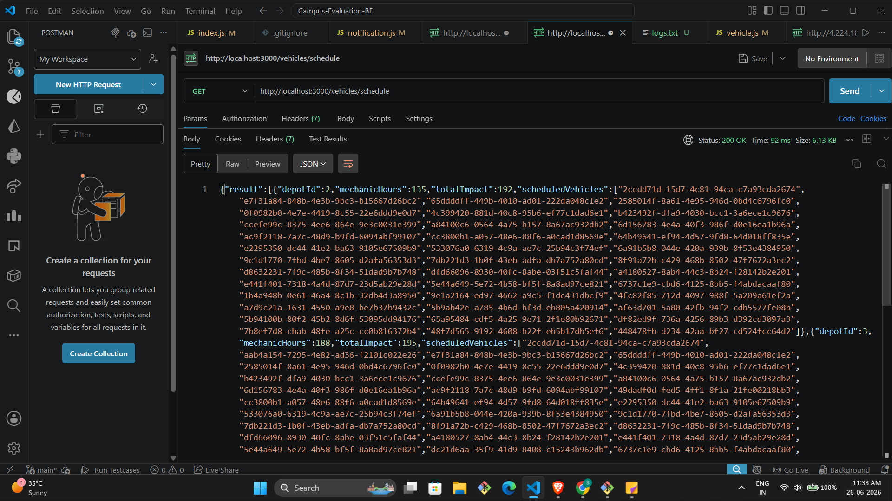
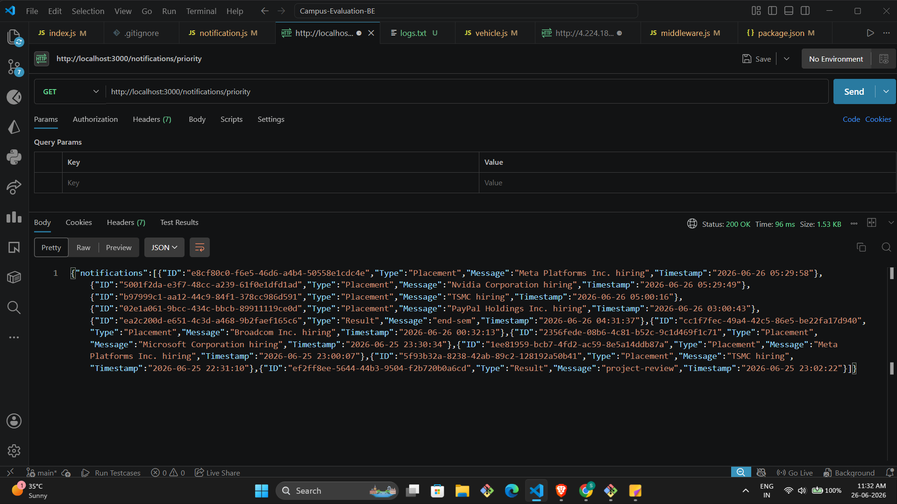

# Notification System Design

## Stage 1

### REST API Design for Campus Notification Platform

User actions the platform should support:
- View all notifications
- Mark a notification as read
- Get unread notification count

#### Endpoints

**GET /notifications**
Headers: `Authorization: Bearer <token>`
Response:
```json
{
  "notifications": [
    {
      "id": "uuid",
      "type": "Placement",
      "message": "string",
      "isRead": false,
      "createdAt": "2026-06-26T05:29:58Z"
    }
  ]
}
```

**PATCH /notifications/:id/read**
Headers: `Authorization: Bearer <token>`
Response:
```json
{ "message": "marked as read" }
```

**GET /notifications/unread/count**
Headers: `Authorization: Bearer <token>`
Response:
```json
{ "count": 5 }
```

For real-time I would use SSE (Server-Sent Events) since notifications are one-way server to client, no need for full duplex like websockets.

---

## Stage 2

### Database

I'd go with PostgreSQL. Data is structured, relations are simple and we need to filter by studentID and isRead a lot so SQL works well here.

#### Schema

```sql
CREATE TYPE notification_type AS ENUM ('Placement', 'Result', 'Event');

CREATE TABLE students (
  id UUID PRIMARY KEY,
  name VARCHAR(100),
  email VARCHAR(100) UNIQUE
);

CREATE TABLE notifications (
  id UUID PRIMARY KEY DEFAULT gen_random_uuid(),
  student_id UUID REFERENCES students(id),
  type notification_type,
  message TEXT,
  is_read BOOLEAN DEFAULT false,
  created_at TIMESTAMP DEFAULT NOW()
);
```

Problems at scale: table grows very fast with 50k students. Without indexes every query is a full scan.

Fetch unread for a student:
```sql
SELECT * FROM notifications
WHERE student_id = $1 AND is_read = false
ORDER BY created_at DESC;
```

Students who got placement notification in last 7 days:
```sql
SELECT DISTINCT student_id FROM notifications
WHERE type = 'Placement'
AND created_at >= NOW() - INTERVAL '7 days';
```

---

## Stage 3

### Query Optimization

The slow query:
```sql
SELECT * FROM notifications
WHERE studentID = 1042 AND isRead = false
ORDER BY createdAt DESC;
```

It's slow because there are no indexes so it scans all 5 million rows.

Fix — add a composite index:
```sql
CREATE INDEX idx_notif_student_read
ON notifications(student_id, is_read, created_at DESC);
```

Adding indexes on every column is not a good idea. Indexes slow down INSERT and UPDATE. With high notification volume, writes happen constantly so too many indexes will hurt write performance.

Query for placement notifications in last 7 days:
```sql
SELECT DISTINCT student_id FROM notifications
WHERE type = 'Placement'
AND created_at >= NOW() - INTERVAL '7 days';
```

---

## Stage 4

### Reducing DB Load on Page Load

Problem: DB getting hit every page load for every student.

Options:

**Redis caching** — cache each student's notifications for 60 seconds. On new notification invalidate their cache. Small staleness tradeoff but huge reduction in DB hits.

**Pagination** — don't load all notifications at once, use limit/offset. Reduces data transferred per request.

**Read replica** — route all reads to a replica, writes go to primary. Tradeoff is replication lag and extra infra cost.

I'd start with Redis caching as it gives immediate relief without much complexity.

---

## Stage 5

### Fixing notify_all

Problems with current implementation:
- send_email fails at student 200, remaining 49800 get nothing
- sequential email + DB insert per student is very slow
- no retries on failure

DB save and email should NOT happen together. Save to DB first always. Email is a side effect and can be retried. If DB fails we lose the record.

Revised pseudocode:
```javascript
async function notify_all(student_ids, message) {
  await db.bulkInsert(student_ids.map(id => ({
    student_id: id,
    message,
    type: 'Placement',
    is_read: false
  })));

  await queue.addBulk(student_ids.map(id => ({
    job: 'send_email',
    data: { student_id: id, message }
  })));

  sse.broadcast({ message, type: 'Placement' });
}
```

---

## Stage 6

### Priority Inbox

Priority score per notification:
- Placement = weight 3, Result = weight 2, Event = weight 1
- Recency also matters — newer = higher score

Formula: score = typeWeight * 10 - ageInMinutes * 0.1

To maintain top 10 efficiently as new notifications keep coming — use a min-heap of size 10. When a new notification arrives, if its score is greater than the heap minimum, replace it. This is O(log 10) which is effectively constant time.

Both endpoints are working. Sample outputs and full screenshots are attached below.

**Vehicle Scheduler** — sample:
```json
{
  "depotId": 1,
  "mechanicHours": 60,
  "totalImpact": 117,
  "scheduledVehicles": ["dfa12f6c-...", "ebfd0164-...", "..."]
}
```

**Notification Priority** — sample:
```json
{
  "ID": "e8cf80c0-...",
  "Type": "Placement",
  "Message": "Meta Platforms Inc. hiring",
  "Timestamp": "2026-06-26 05:29:58"
}
```

#### Screenshots

Vehicle Scheduler Output:


Notification Priority Output:
